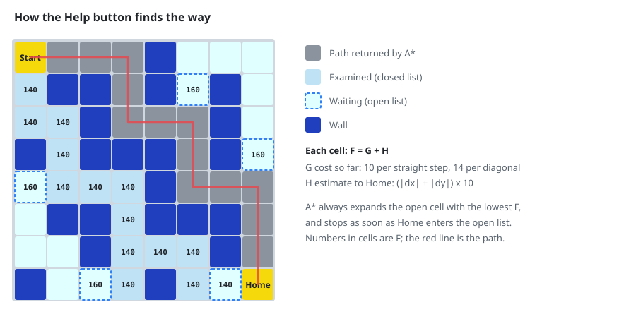

<div align="center">

# MazeSolver · A\* Maze Game

**Guide the sheep home through a random maze before you run out of steps or time.<br>
Stuck? Click Help and the A\* algorithm draws the way from where you stand.**

[](https://easyx.cn/)
[](#build-from-source)
[](#build-from-source)
[](LICENSE)

**English** · [简体中文](README.zh-CN.md)

</div>

https://github.com/chchaoo/Maze-Game-uses-Astar-algorithm/assets/166147704/da050e9e-ba81-436d-87aa-2482a5c648c6

## How to play

1. On the title screen, press <kbd>1</kbd>–<kbd>4</kbd> to choose your sheep, then any other key to start. <kbd>P</kbd> quits.
2. A new 15 × 15 maze is generated. Your sheep starts in the top-left corner; home is in the bottom-right.
3. Walk home with <kbd>W</kbd> <kbd>A</kbd> <kbd>S</kbd> <kbd>D</kbd> or the arrow keys.
4. Click **Help** to have A\* draw a path from your current position to home.

| | |
|---|---|
| **Steps** | 40. Every move costs one. |
| **Time** | 90 seconds, counting down on screen. |
| **Score** | steps left × 100 − seconds used. If the steps or the time run out, the score is 0. |

Every maze is random: each cell becomes a wall with a 1 in 4 chance. The generator keeps trying until A\* confirms there is a way from start to home, so every maze can be solved.

## How Help finds the way

<p align="center"></p>

The diagram is not a drawing made by hand. It is the output of the game's own A\* (`value()` in [`test/test.cpp`](test/test.cpp)) run on an 8 × 8 grid with the same rules:

- a cell may step to its 8 neighbours; a diagonal step is allowed only if both cells beside it are open, so the path never cuts a wall corner;
- a straight step costs 10 and a diagonal step 14 (≈ 10 × √2);
- H, the estimate to home, is the Manhattan distance × 10;
- the open cell with the lowest F = G + H is expanded next, and the search stops as soon as home joins the open list. Following each cell's parent back from home gives the path.

## Build from source

**You need:** Windows, [Visual Studio 2022](https://visualstudio.microsoft.com/) with *Desktop development with C++*, and the [EasyX graphics library](https://easyx.cn/) (its installer adds itself to Visual Studio).

1. Clone the repository, or download it with **Code → Download ZIP**.
2. Open `test.sln` in Visual Studio.
3. Choose the **x64** platform and press <kbd>F5</kbd>.

The game loads its pictures and `music.wav` from the working directory. Run from Visual Studio, that is the `test/` folder, where they are. To run the `.exe` on its own, copy the `.jpg` files and `music.wav` next to it.

```
MazeSolver-Astar/
├── test.sln               Visual Studio solution
└── test/
    ├── test.cpp           the whole game: title screen, maze, movement, A*, scoring
    ├── Astar.h            A* node structure
    ├── test.vcxproj       project file
    ├── *.jpg              title animation frames, sheep, house, backgrounds
    └── music.wav          background music
```

## Ideas for improvement

- **Match Help to how the sheep moves.** The sheep walks in 4 directions, but A\* may suggest diagonal steps. Searching only the 4 straight neighbours would make every suggested step playable.
- **Guarantee the shortest path.** With diagonal steps, Manhattan distance × 10 can overestimate the remaining cost, so A\* may return a path that is not the shortest. With 4-way movement Manhattan distance is exact; with 8-way movement, the *octile* distance is the matching estimate.
- **Load images once.** The sheep picture is read from disk on every frame. Loading it once before the loop would make the game lighter.

## License

The **source code** is released under the [MIT License](LICENSE).

The **images and music** in `test/` come from third parties and are **not** covered by the MIT License. See [NOTICE.md](NOTICE.md). If you redistribute the game, replace them with assets you have the rights to.

## More projects

- [sha256-folder-verify](https://github.com/chchaoo/sha256-folder-verify): check that a copied folder is byte-for-byte identical, one `.bat` for Windows.
- [RCPlane-SU27](https://github.com/chchaoo/RCPlane-SU27) and [Modified-FTVersaWing](https://github.com/chchaoo/Modified-FTVersaWing): foam-board RC plane plans.
