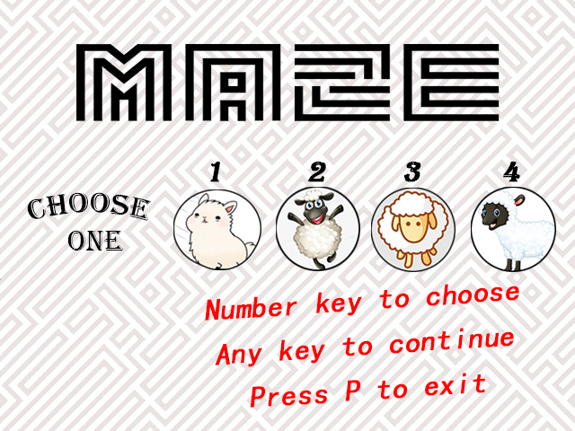
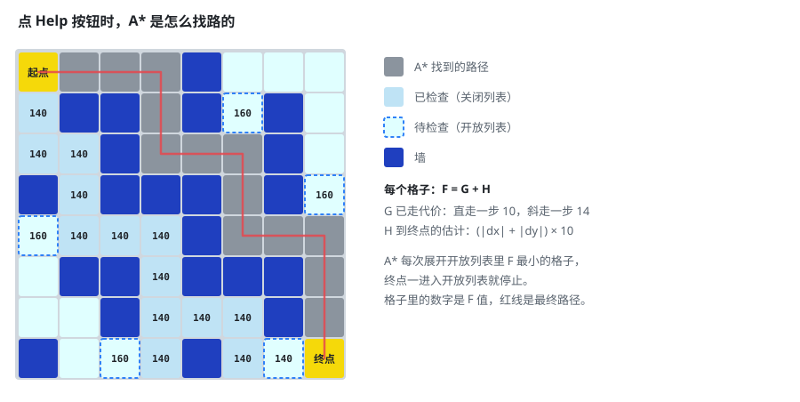

<div align="center">

# MazeSolver · A* 迷宫游戏

**在步数和时间用完之前，带小羊穿过随机迷宫回家。<br>
走不出去了？点 Help，A* 算法会从你当前的位置画出回家的路。**

[](https://easyx.cn/)
[](#从源码编译)
[](#从源码编译)
[](LICENSE)

[English](README.md) · **简体中文**



</div>

https://github.com/chchaoo/Maze-Game-uses-Astar-algorithm/assets/166147704/da050e9e-ba81-436d-87aa-2482a5c648c6

## 怎么玩

1. 在标题画面按 <kbd>1</kbd>～<kbd>4</kbd> 选择小羊，再按其他任意键开始；按 <kbd>P</kbd> 退出。
2. 程序随机生成一个 15 × 15 的迷宫。小羊从左上角出发，家在右下角。
3. 用 <kbd>W</kbd> <kbd>A</kbd> <kbd>S</kbd> <kbd>D</kbd> 或方向键走回家。
4. 点击 **Help**，A* 会画出从当前位置到家的路线。

| | |
|---|---|
| **步数** | 40 步，每走一步减一。 |
| **时间** | 90 秒，屏幕上倒计时。 |
| **得分** | 剩余步数 × 100 − 已用秒数。步数或时间用完，得分为 0。 |

每个迷宫都是随机的：每个格子有 1/4 的概率成为墙。生成器会一直重试，直到 A* 确认从起点到家有路可走，所以每个迷宫都一定能走通。

## Help 是怎么找路的

<p align="center"></p>

这张图不是手画的示意图，而是用游戏自己的 A*（[`test/test.cpp`](test/test.cpp) 里的 `value()`）按同样的规则在 8 × 8 网格上实际跑出来的结果：

- 每个格子可以走向周围 8 个格子；只有斜对角两侧的格子都不是墙时才允许斜走，所以路线不会穿过墙角；
- 直走一步代价 10，斜走一步代价 14（≈ 10 × √2）；
- H（到家的估计代价）= 曼哈顿距离 × 10；
- 每次展开开放列表里 F = G + H 最小的格子，家一进入开放列表就停止搜索。从家开始沿着每个格子的"父节点"往回走，就得到了路线。

## 从源码编译

**需要：** Windows、安装了"使用 C++ 的桌面开发"的 [Visual Studio 2022](https://visualstudio.microsoft.com/)，以及 [EasyX 图形库](https://easyx.cn/)（安装程序会自动集成到 Visual Studio）。

1. 克隆仓库，或者点 **Code → Download ZIP** 下载。
2. 用 Visual Studio 打开 `test.sln`。
3. 平台选 **x64**，按 <kbd>F5</kbd> 运行。

游戏从工作目录加载图片和 `music.wav`。从 Visual Studio 里运行时，工作目录就是存放这些文件的 `test/` 文件夹。如果要单独运行生成的 `.exe`，需要把 `.jpg` 图片和 `music.wav` 复制到它旁边。

```
MazeSolver-Astar/
├── test.sln               Visual Studio 解决方案
└── test/
    ├── test.cpp           整个游戏：标题画面、迷宫、移动、A*、计分
    ├── Astar.h            A* 节点结构
    ├── test.vcxproj       工程文件
    ├── *.jpg              标题动画帧、小羊、房子、背景图
    └── music.wav          背景音乐
```

## 可以改进的地方

- **让 Help 的路线和小羊的走法一致。** 小羊只能上下左右走，但 A* 给出的路线里可能有斜走的步子。只搜索上下左右 4 个相邻格子，就能保证提示的每一步都走得通。
- **保证找到最短路径。** 允许斜走时，"曼哈顿距离 × 10"可能高估剩余代价，A* 返回的路线不一定最短。只走 4 个方向时曼哈顿距离正好准确；允许 8 个方向时，对应的估计方法是"八方向距离"（octile distance）。
- **图片只加载一次。** 现在小羊的图片每一帧都从磁盘重新读取，放到循环外面加载一次，游戏会更轻快。

## 许可证

**源代码**采用 [MIT 许可证](LICENSE)。

`test/` 里的**图片和音乐**来自第三方，**不在** MIT 许可证的授权范围内，详见 [NOTICE.md](NOTICE.md)。如果要再分发这个游戏，请换成你有权使用的素材。

## 其他项目

- [sha256-folder-verify](https://github.com/chchaoo/sha256-folder-verify)：确认复制出来的文件夹和原件逐字节一致，Windows 上一个 `.bat` 就能用。
- [RCPlane-SU27](https://github.com/chchaoo/RCPlane-SU27) 和 [Modified-FTVersaWing](https://github.com/chchaoo/Modified-FTVersaWing)：KT 板航模图纸。
